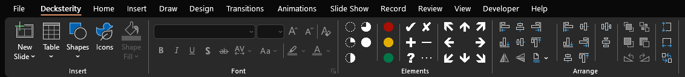

# Decksterity

Decksterity is a free and open source PowerPoint add-in that aims to replicate core consulting toolbar elements, 
inspired by add-ins like [Instrumenta](https://github.com/iappyx/Instrumenta) or [Design Toolbars](https://designtoolbars.com). While Decksterity is more limited than both of these options, it includes the elements and alignment tools that I most frequently leverage conveniently centralized to one ribbon tab with familiar, easily learned hotkeys (which will be most familiar to Bain Toolbox users). 

Decksterity works best when combined with [**think-cell**](https://www.think-cell.com/en) to provide key missing consulting toolbox functionality - e.g., charts and graphs, agenda slides, chevrons, save/send slides, and much more. Additionally, Decksterity will be more useful if you invest in creating a [PowerPoint template](https://support.microsoft.com/en-us/office/create-and-save-a-powerpoint-template-ee4429ad-2a74-4100-82f7-50f8169c8aca) and [think-cell style file](https://www.think-cell.com/en/resources/manual/customization) suited to your needs. 

## 🚀 Install

**[Download the latest release](https://github.com/avirut/decksterity/releases/latest)**

### Installation Steps:
1. **Download** the latest `DecksteritySetup.msi` from the latest release from the above link
2. **Run** the installer -- you may see prompts about access / certificates when doing this, but should be feasible to get through
3. **Follow** the installation prompts
4. **Start PowerPoint** to use the add-in!

### Updating:
To update to a newer version, simply download and install the latest release. The installer will handle upgrading your existing installation.

## ✨ Features

### Visual Elements
- **Harvey Balls**: Progress indicators (0-4 fill levels: ⭘, ◔, ◑, ◕, ●)
- **Arrows**: 8-directional arrows (🡹, 🡽, 🡺, 🡾, 🡻, 🡿, 🡸, 🡼)
- **Icons**: Basic symbols (✔, ✘, ➕, ➖, ❓, …)
- **Stoplights**: Colored status indicators (red, amber, green)

### Layout Tools
- **Alignment**: Left, center, right, top, middle, bottom
- **Distribution**: Even horizontal and vertical spacing
- **Sizing**: Make shapes same width/height
- **Advanced Spacing**: Resize and space evenly with preservation options
- **Primary Alignment**: Align all objects relative to the first selected object
- **Position Swapping**: Swap positions of two selected objects

### Keyboard shorcuts

- **Access keys (alt shortcuts)**: Each function is tagged to access keys that will be most familiar to Bain Toolbox users - e.g., `Alt-X-AL` for aligning left; in order to keep this one tab, primary aligns will fall into the same first-level access key (e.g., `Alt-P-AL` from Bain Toolbox becomes `Alt-X-PAL`)
- **Control keys**: Decksterity provides the same control hotkeys (e.g., `Ctrl+Shift+1` to align left) as the Bain Toolbox 

## 📃 Miscellaneous

### Architecture

Decksterity is built using C# and the Visual Studio Tools for Office (VSTO) framework. Refer to this project's CLAUDE.md for more details on architecture, as well as a good starting point for adding in features.

### License & development

Decksterity is provided with an MIT license - install & use at your own risk, no warranty or support is guaranteed. However, PRs and feedback are welcome! Please feel free to submit issues if you encounter any problems.